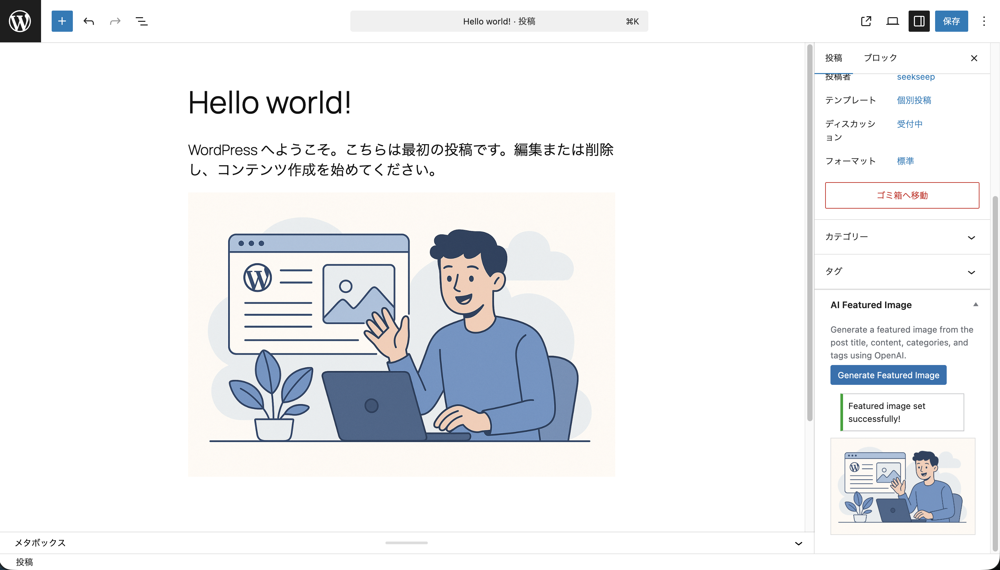

# WP AI Featured Image Generator

WordPressの投稿タイトル・本文・カテゴリ・タグをもとに、OpenAI Images APIでアイキャッチ画像を自動生成するWordPressプラグインです。

## 機能

- 投稿編集画面のサイドバーから「Generate Featured Image」ボタンで画像を生成
- 投稿のタイトル・本文・カテゴリ・タグからプロンプトを自動構築
- OpenAI Images API（gpt-image-1, DALL-E 3, DALL-E 2）に対応
- 生成した画像をWordPressメディアライブラリに保存し、アイキャッチ画像に設定
- 日本語記事にも対応
- 文字が入らない、ブログ向け横長画像を生成

## スクリーンショット



## 動作要件

- PHP 8.2 以上
- WordPress 6.0 以上
- OpenAI API キー
- Composer（開発時）

## インストール

### 1. プラグインの配置

```bash
cd wp-content/plugins/
git clone https://github.com/seekseep/wp-ai-featured-image-generator.git wp-ai-featured-image
cd wp-ai-featured-image
composer install --no-dev
```

### 2. APIキーの設定

**推奨: wp-config.php で設定する方法**

```php
define( 'WP_AI_FEATURED_IMAGE_API_KEY', 'sk-your-api-key-here' );
```

**環境変数で設定する方法**

```bash
export OPENAI_API_KEY="sk-your-api-key-here"
```

**管理画面から設定する方法**

Settings > AI Featured Image の設定ページからAPIキーを入力できます。
ただし、セキュリティの観点から wp-config.php または環境変数での設定を推奨します。

### 3. プラグインの有効化

WordPress管理画面の「プラグイン」ページから「WP AI Featured Image Generator」を有効化してください。

## 設定

Settings > AI Featured Image から以下の項目を設定できます。

| 項目 | 説明 | デフォルト値 |
|------|------|-------------|
| API Key | OpenAI APIキー（定数/環境変数未設定時のみ使用） | - |
| Model | 画像生成モデル | gpt-image-1 |
| Image Size | 生成画像のサイズ | 1536x1024 (Landscape) |
| Quality | 画像品質 | Auto |

APIキーは [OpenAI Platform](https://platform.openai.com/api-keys) から取得できます。

## 使い方

1. 投稿の編集画面を開く
2. タイトルと本文を入力する（カテゴリ・タグも設定するとより適切な画像になります）
3. サイドバーの「AI Featured Image」パネルにある「Generate Featured Image」ボタンをクリック
4. 画像生成が完了すると、自動的にアイキャッチ画像に設定されます

> **注意**: 画像生成には30秒〜1分程度かかる場合があります。

## 開発

### セットアップ

```bash
git clone https://github.com/seekseep/wp-ai-featured-image-generator.git
cd wp-ai-featured-image-generator
composer install
```

### コーディング規約チェック (WPCS)

```bash
composer lint
```

自動修正:

```bash
composer lint:fix
```

### 静的解析 (PHPStan)

```bash
composer stan
```

### テスト (PHPUnit)

```bash
composer test
```

### 全チェック

```bash
composer lint && composer stan && composer test
```

## アーキテクチャ

```
src/
├── Plugin.php              # フック登録のオーケストレーター
├── ConfigResolver.php      # 設定値の解決（定数 → 環境変数 → DB）
├── PromptBuilder.php       # 投稿データからプロンプト生成
├── OpenAiImageService.php  # OpenAI Images API 呼び出し
├── MediaService.php        # メディアライブラリへの保存
├── AjaxController.php      # AJAX リクエストハンドラー
├── AdminSettings.php       # 設定ページ
└── MetaBox.php             # 投稿編集画面のメタボックス
```

## セキュリティ方針

- **APIキーの保護**: wp-config.php の定数または環境変数での設定を推奨。DB保存時もパスワードフィールドで表示
- **CSRF対策**: すべてのAJAXリクエストでnonce検証を実施
- **権限チェック**: `current_user_can('edit_post')` による権限確認
- **入力サニタイズ**: `sanitize_text_field()`, `absint()` 等で全入力を検証
- **出力エスケープ**: `esc_html()`, `esc_attr()` 等で出力をエスケープ
- **プロンプト注入防止**: 投稿内容からHTMLタグ・改行を除去してからプロンプトに使用

## 今後の改善案

- [ ] ブロックエディターのサイドバーパネル対応（React/JSX）
- [ ] プロンプトのカスタマイズ機能（管理画面からテンプレート編集）
- [ ] 画像生成履歴の記録と管理
- [ ] バルク生成機能（複数投稿を一括処理）
- [ ] カスタム投稿タイプの対応設定
- [ ] 画像のスタイル選択機能（イラスト、写真風、抽象画等）
- [ ] 生成前のプロンプトプレビューと編集
- [ ] WP-CLI コマンド対応
- [ ] 多言語翻訳ファイル (.pot) の追加
- [ ] WordPress.org プラグインディレクトリへの公開準備

## ライセンス

[MIT License](LICENSE)
